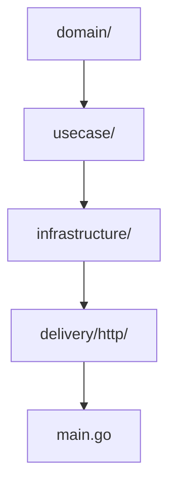
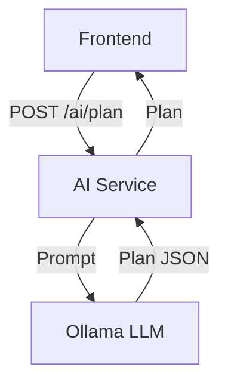
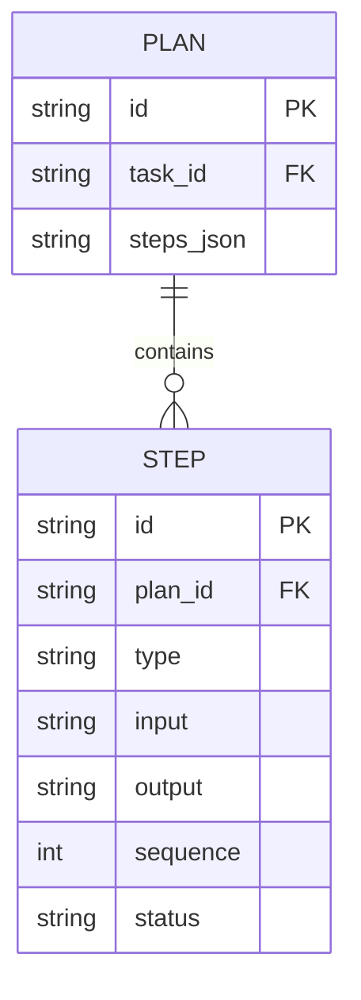

# AI Service

This microservice handles AI Reasoning (plan generation) using a local LLM (Ollama, DeepSeek-R1).

- **Tech stack:** Go, Gin, REST client for Ollama
- **Architecture:** Clean Architecture, DDD
- **APIs:**
  - `POST /ai/plan` - Generate a plan for a task
    - **Request:** `{ "task_type": "code|browse|fs", "payload": { ... } }`
    - **Response:** `{ "steps": [ { "type": "code|browse|fs", "input": "...", "sequence": 1 }, ... ] }`
    - **Errors:** `400 Bad Request`, `500 Internal Server Error`
  - `GET /ai/health` - Health check endpoint
    - **Response:** `{ "status": "ok" }`

## Structure Diagram

## Features
- Stepwise plan generation for tasks
- Integration with local LLM (Ollama)
- Clean separation of concerns

## Data Flow Diagram (DFD)

## Entity Relationship Diagram (ERD)

## Database Table
| Field      | Type   | PK | FK | Description         |
|------------|--------|----|----|---------------------|
| id         | TEXT   | Y  |    | Plan ID             |
| task_id    | TEXT   |    | Y  | FK to Task          |
| steps_json | TEXT   |    |    | Serialized steps    |

## Testing
- Table-driven tests for plan generation and handlers

## Security
- Input validation, prompt sanitization, logging

## Swagger / OpenAPI
- Full OpenAPI 3.0 spec is available at `/swagger/doc.json`.
- Swagger UI is served at `/swagger/index.html` (if enabled in config).
- To view and try APIs interactively, open `http://localhost:<port>/swagger/index.html` in your browser.

## Documentation
- OpenAPI spec and usage examples
