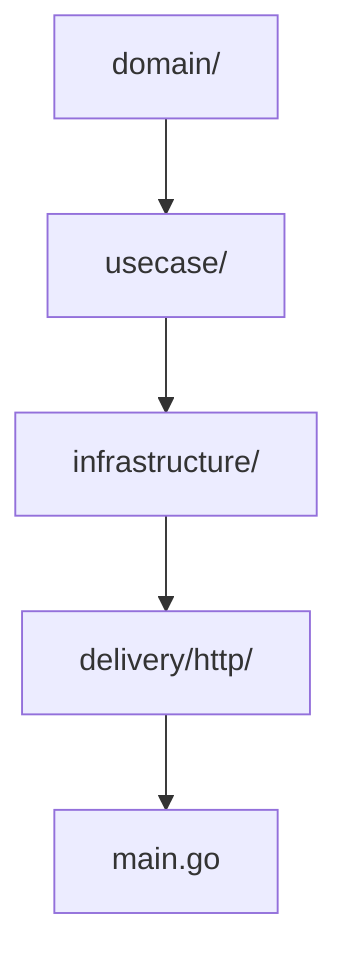
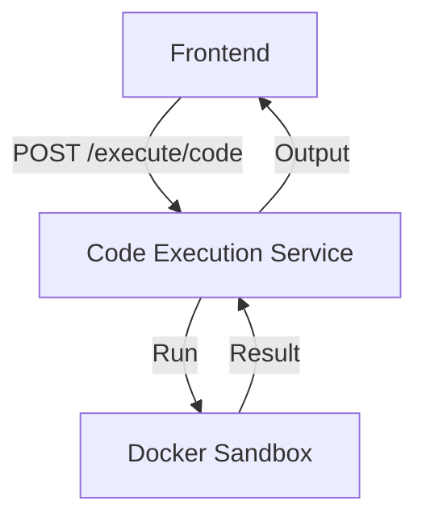
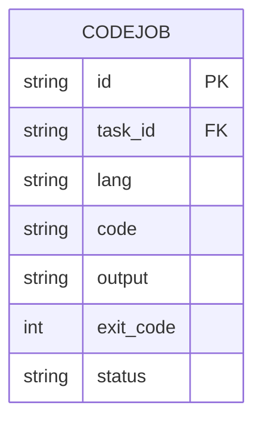

# Code Execution Service

This microservice executes code securely in sandboxed Docker containers as part of the Tool Execution bounded context.

- **Tech stack:** Go, Gin, Docker Go SDK
- **Architecture:** Clean Architecture, DDD
- **APIs:**
  - `POST /execute/code` - Execute code in a sandbox
    - **Request:** `{ "lang": "python|go|js", "code": "..." }`
    - **Response:** `{ "output": "...", "exit_code": 0, "status": "done" }`
    - **Errors:** `400 Bad Request`, `500 Internal Server Error`
  - `GET /execute/health` - Health check endpoint
    - **Response:** `{ "status": "ok" }`

## Structure Diagram

## Features
- Secure code execution in Docker
- Language/runtime extensibility
- Result and error reporting

## Data Flow Diagram (DFD)

## Entity Relationship Diagram (ERD)

## Database Table
| Field      | Type   | PK | FK | Description         |
|------------|--------|----|----|---------------------|
| id         | TEXT   | Y  |    | Job ID              |
| task_id    | TEXT   |    | Y  | FK to Task          |
| lang       | TEXT   |    |    | Language            |
| code       | TEXT   |    |    | Code to execute     |
| output     | TEXT   |    |    | Execution output    |
| exit_code  | INT    |    |    | Exit code           |
| status     | TEXT   |    |    | Job status          |

## Testing
- Table-driven tests for all usecases and handlers

## Security
- Docker sandboxing, FS restriction, input validation

## Documentation
- OpenAPI spec and usage examples
