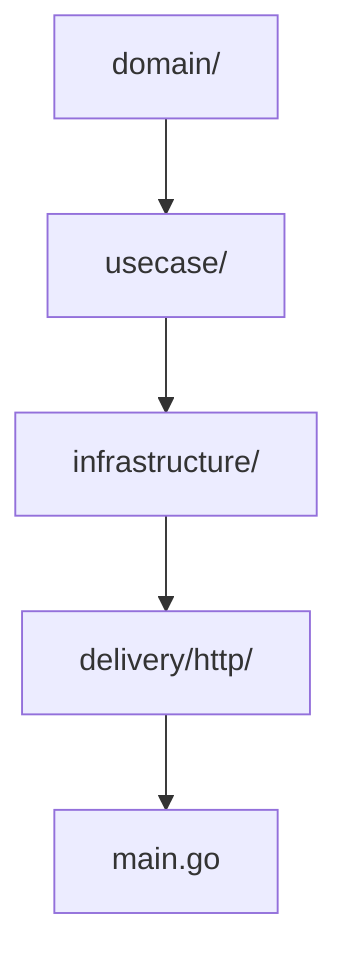
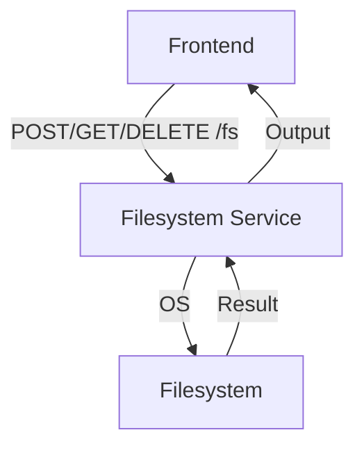
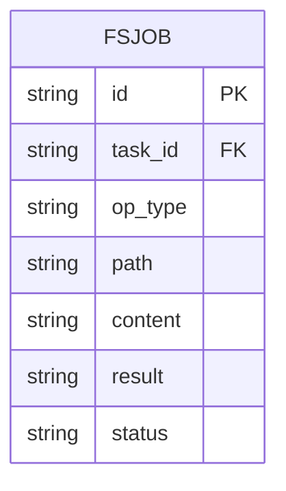

# Filesystem Service

This microservice performs secure file operations (read, write, delete) restricted to `/app/workspace` as part of the Tool Execution bounded context.

- **Tech stack:** Go, Gin, os package
- **Architecture:** Clean Architecture, DDD
- **APIs:**
  - `GET /fs/read` - Read file
    - **Query:** `?path=<file_path>`
    - **Response:** `{ "content": "..." }`
    - **Errors:** `400 Bad Request`, `404 Not Found`, `500 Internal Server Error`
  - `POST /fs/write` - Write file
    - **Request:** `{ "path": "<file_path>", "content": "..." }`
    - **Response:** `{ "status": "ok" }`
    - **Errors:** `400 Bad Request`, `500 Internal Server Error`
  - `DELETE /fs/delete` - Delete file
    - **Request:** `{ "path": "<file_path>" }`
    - **Response:** `{ "status": "ok" }`
    - **Errors:** `400 Bad Request`, `404 Not Found`, `500 Internal Server Error`
  - `GET /fs/health` - Health check endpoint
    - **Response:** `{ "status": "ok" }`

## Structure Diagram

## Features
- Secure file read/write/delete
- Path whitelisting and validation
- Full audit logging

## Data Flow Diagram (DFD)

## Entity Relationship Diagram (ERD)

## Database Table
| Field      | Type   | PK | FK | Description         |
|------------|--------|----|----|---------------------|
| id         | TEXT   | Y  |    | Job ID              |
| task_id    | TEXT   |    | Y  | FK to Task          |
| op_type    | TEXT   |    |    | Operation type      |
| path       | TEXT   |    |    | File path           |
| content    | TEXT   |    |    | File content        |
| result     | TEXT   |    |    | Output/result       |
| status     | TEXT   |    |    | Job status          |

## Testing
- Table-driven tests for all usecases and handlers

## Security
- Path whitelisting, input validation, audit logs

## Documentation
- OpenAPI spec and usage examples
