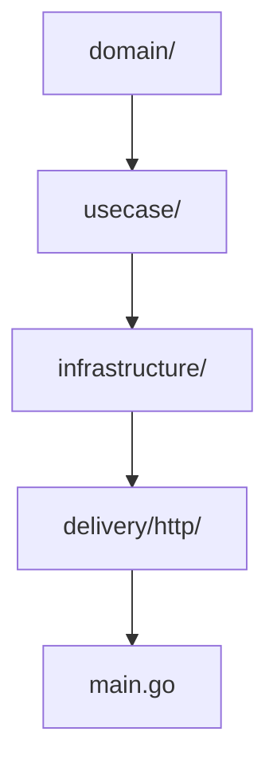
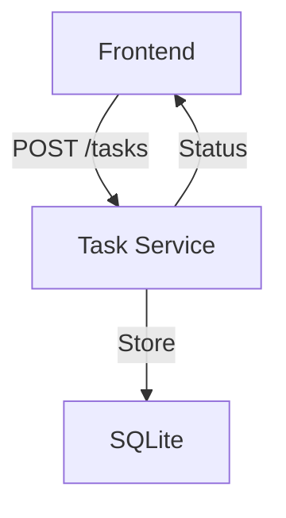
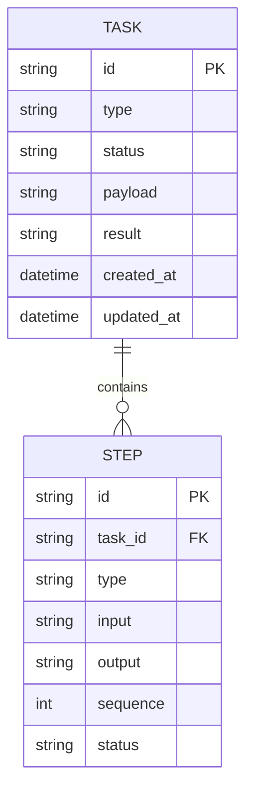

# Task Service

This microservice manages the lifecycle of tasks (submission, status, results) as the Task Management bounded context.

- **Tech stack:** Go, Gin, SQLite
- **Architecture:** Clean Architecture, DDD
- **APIs:**
  - `POST /tasks` - Submit a new task
    - **Request:** `{ "type": "code|browse|fs", "payload": { ... } }`
    - **Response:** `{ "id": "<task_id>", "status": "pending" }`
    - **Errors:** `400 Bad Request`, `500 Internal Server Error`
  - `GET /tasks/:id` - Get task status/result
    - **Response:** `{ "id": "<task_id>", "status": "pending|running|done|failed", "result": { ... } }`
    - **Errors:** `404 Not Found`, `500 Internal Server Error`
  - `GET /tasks` - List all tasks
    - **Response:** `[ { "id": "<task_id>", "status": "..." }, ... ]`
  - `GET /tasks/health` - Health check endpoint
    - **Response:** `{ "status": "ok" }`

## Structure Diagram

## Features
- Task submission, status, and result retrieval
- Task listing and filtering
- Full lifecycle management

## Data Flow Diagram (DFD)

## Entity Relationship Diagram (ERD)

## Database Table
| Field       | Type      | PK | FK | Description                |
|-------------|-----------|----|----|----------------------------|
| id          | TEXT      | Y  |    | Task unique identifier     |
| type        | TEXT      |    |    | Task type (code, browse)   |
| status      | TEXT      |    |    | Task status                |
| payload     | TEXT      |    |    | Task input payload         |
| result      | TEXT      |    |    | Task result (JSON)         |
| created_at  | DATETIME  |    |    | Creation timestamp         |
| updated_at  | DATETIME  |    |    | Last update timestamp      |

## Testing
- Table-driven tests for all usecases and handlers

## Security
- Input validation, parameterized queries, no direct SQL in handlers

## Documentation
- OpenAPI spec and usage examples
