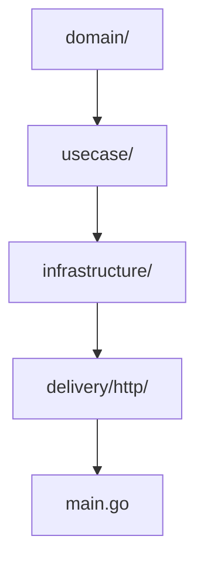
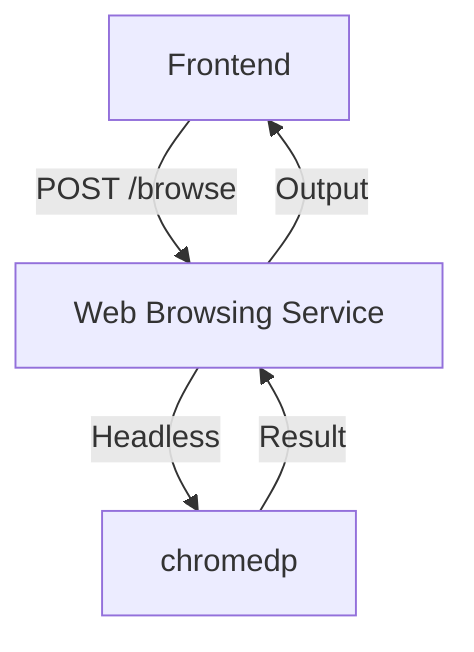
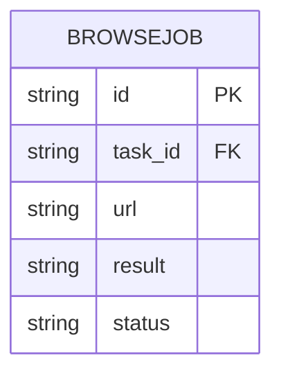

# Web Browsing Service

This microservice performs web browsing and scraping via chromedp as part of the Tool Execution bounded context.

- **Tech stack:** Go, Gin, chromedp
- **Architecture:** Clean Architecture, DDD
- **APIs:**
  - `POST /browse` - Fetch and process a web page
    - **Request:** `{ "url": "https://..." }`
    - **Response:** `{ "result": "..." }`
    - **Errors:** `400 Bad Request`, `500 Internal Server Error`
  - `GET /browse/health` - Health check endpoint
    - **Response:** `{ "status": "ok" }`

## Structure Diagram

## Features
- Automated web browsing and scraping
- Domain restriction and output sanitization
- Integration with chromedp

## Data Flow Diagram (DFD)

## Entity Relationship Diagram (ERD)

## Database Table
| Field      | Type   | PK | FK | Description         |
|------------|--------|----|----|---------------------|
| id         | TEXT   | Y  |    | Job ID              |
| task_id    | TEXT   |    | Y  | FK to Task          |
| url        | TEXT   |    |    | URL to fetch        |
| result     | TEXT   |    |    | Output/result       |
| status     | TEXT   |    |    | Job status          |

## Testing
- Table-driven tests for all usecases and handlers

## Security
- Domain restriction, output sanitization, input validation

## Documentation
- OpenAPI spec and usage examples
