# Functional Requirements Specification (FRS)

## 1. Overview
This FRS is organized by feature as defined in the BRD. For each feature, DFDs are provided at Level 0, 1, and 2, along with ERDs, table definitions, and API lists.

---

## 2. Task Management

### 2.1 Functional Requirements
- Submit a task (code, browse, fs)
- Monitor task status (pending, running, done, failed)
- Retrieve task results
- List all tasks

### 2.2 DFDs
#### Level 0
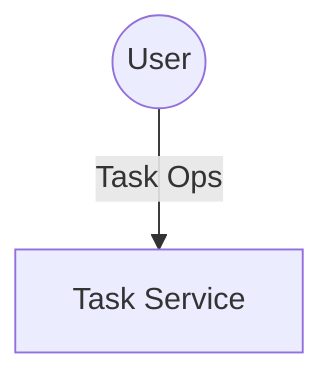
#### Level 1
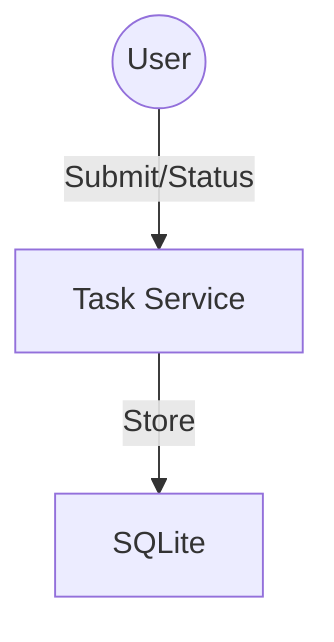
#### Level 2
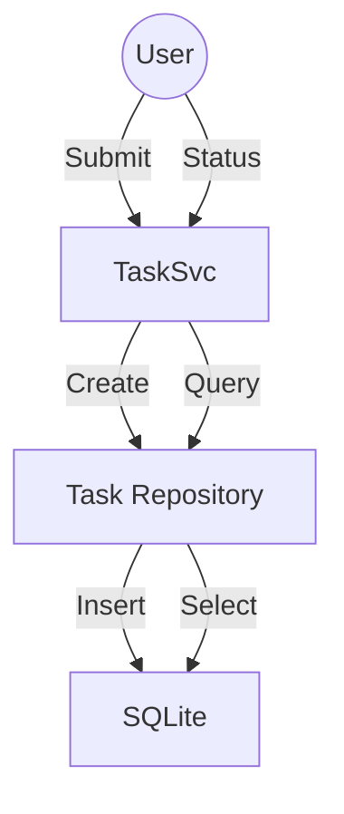

### 2.3 ERD
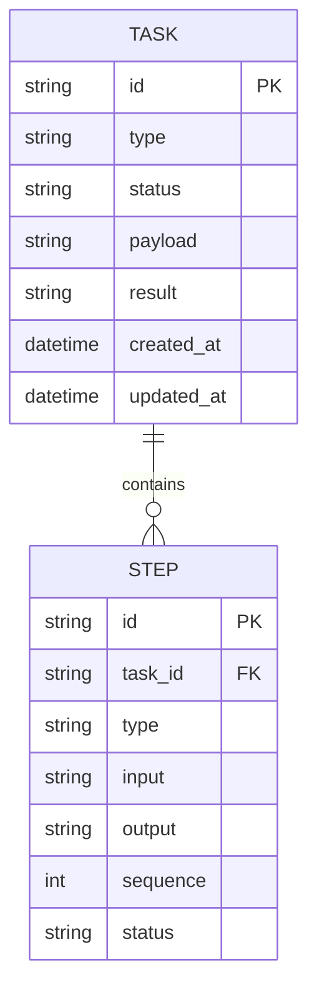

### 2.4 Table Definitions
| Field       | Type      | PK | FK | Description                |
|-------------|-----------|----|----|----------------------------|
| id          | TEXT      | Y  |    | Task unique identifier     |
| type        | TEXT      |    |    | Task type (code, browse)   |
| status      | TEXT      |    |    | Task status                |
| payload     | TEXT      |    |    | Task input payload         |
| result      | TEXT      |    |    | Task result (JSON)         |
| created_at  | DATETIME  |    |    | Creation timestamp         |
| updated_at  | DATETIME  |    |    | Last update timestamp      |

### 2.5 API List
- `POST /tasks` - Submit a new task
- `GET /tasks/:id` - Get task status/result
- `GET /tasks` - List all tasks

---

## 3. Local AI Reasoning

### 3.1 Functional Requirements
- Generate a stepwise plan for each submitted task
- Use only local LLM (Ollama) for planning
- Return plan as a list of executable steps

### 3.2 DFDs
#### Level 0
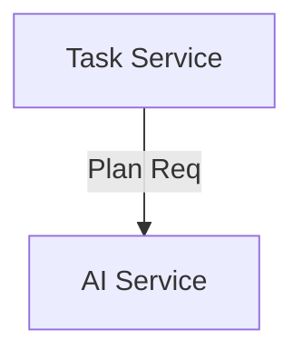
#### Level 1
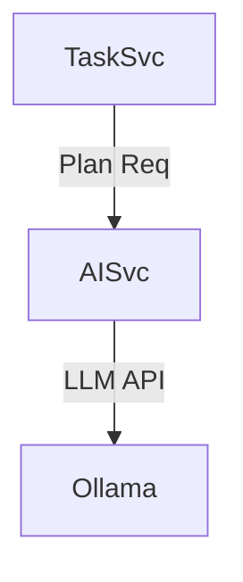
#### Level 2
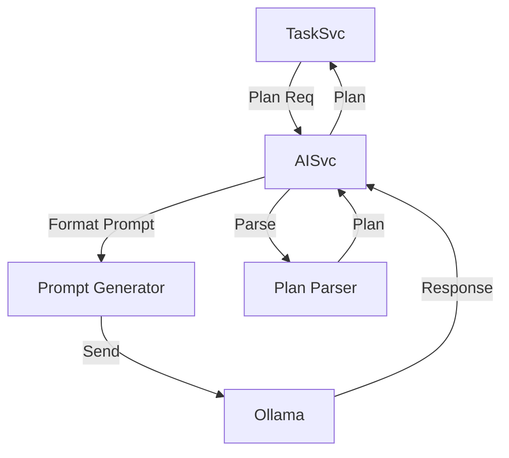

### 3.3 ERD
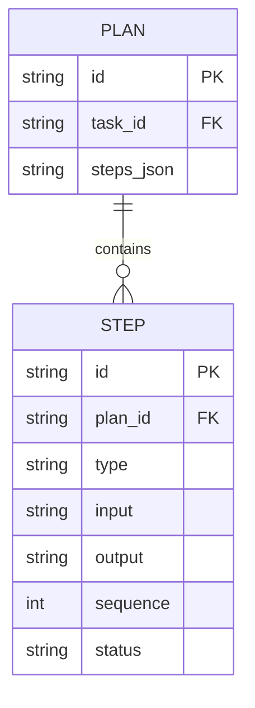

### 3.4 Table Definitions
| Field       | Type      | PK | FK | Description                |
|-------------|-----------|----|----|----------------------------|
| id          | TEXT      | Y  |    | Plan unique identifier     |
| task_id     | TEXT      |    | Y  | FK to Task                 |
| steps_json  | TEXT      |    |    | Serialized steps           |

### 3.5 API List
- `POST /ai/plan` - Generate a plan for a task

---

## 4. Secure Code Execution

### 4.1 Functional Requirements
- Execute code in a sandboxed Docker container
- Return stdout, stderr, and exit code
- Restrict network and filesystem access to /app/workspace

### 4.2 DFDs
#### Level 0
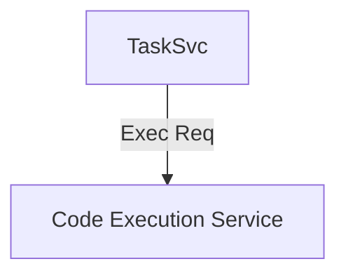
#### Level 1
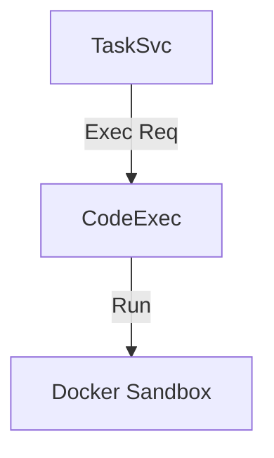
#### Level 2
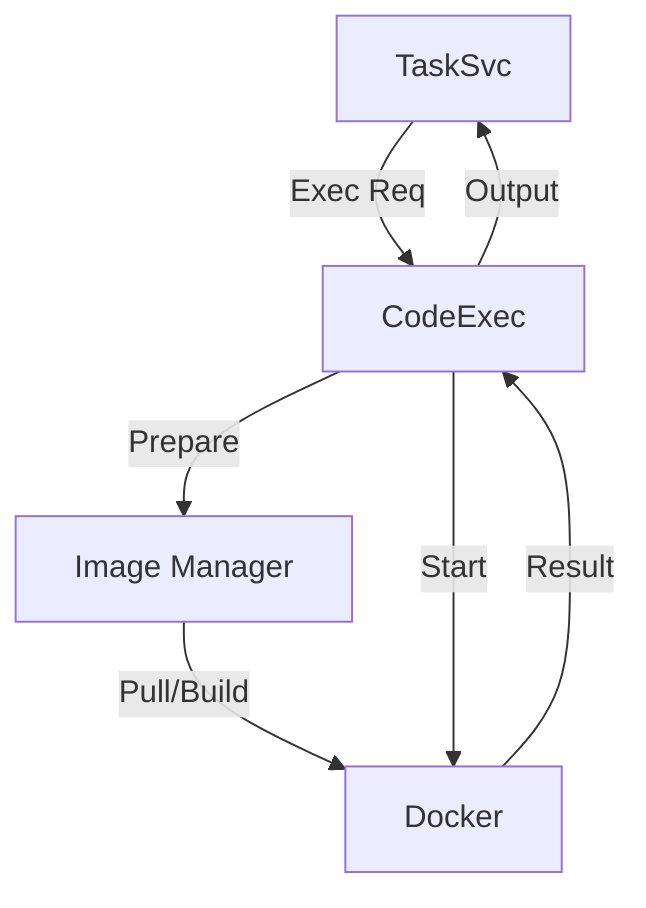

### 4.3 Table Definitions
| Field       | Type      | PK | FK | Description                |
|-------------|-----------|----|----|----------------------------|
| id          | TEXT      | Y  |    | CodeJob unique identifier  |
| task_id     | TEXT      |    | Y  | FK to Task                 |
| lang        | TEXT      |    |    | Programming language       |
| code        | TEXT      |    |    | Code to execute            |
| output      | TEXT      |    |    | Stdout/stderr/output       |
| exit_code   | INTEGER   |    |    | Exit code                  |
| status      | TEXT      |    |    | Job status                 |

### 4.4 API List
- `POST /execute/code` - Execute code in a sandbox

---

## 5. Autonomous Web Browsing

### 5.1 Functional Requirements
- Fetch and process web pages using chromedp
- Return HTML/text or extracted data
- Restrict browsing to allowed domains

### 5.2 DFDs
#### Level 0
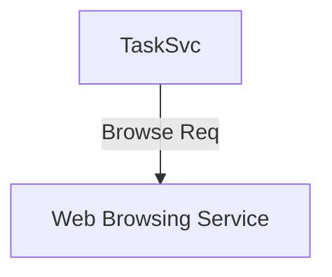
#### Level 1
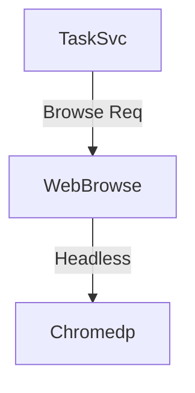
#### Level 2
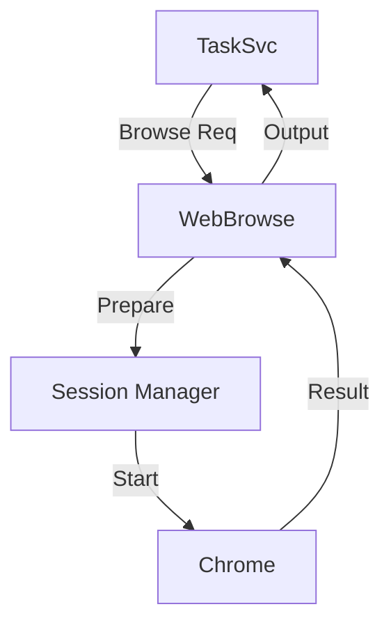

### 5.3 Table Definitions
| Field       | Type      | PK | FK | Description                |
|-------------|-----------|----|----|----------------------------|
| id          | TEXT      | Y  |    | BrowseJob unique identifier|
| task_id     | TEXT      |    | Y  | FK to Task                 |
| url         | TEXT      |    |    | URL to fetch               |
| result      | TEXT      |    |    | Output/result              |
| status      | TEXT      |    |    | Job status                 |

### 5.4 API List
- `POST /browse` - Fetch/process a web page

---

## 6. Secure Filesystem Operations

### 6.1 Functional Requirements
- Read, write, and delete files only within /app/workspace
- Validate all file paths and inputs
- Audit all file operations

### 6.2 DFDs
#### Level 0
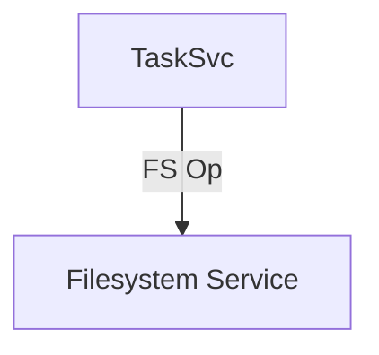
#### Level 1
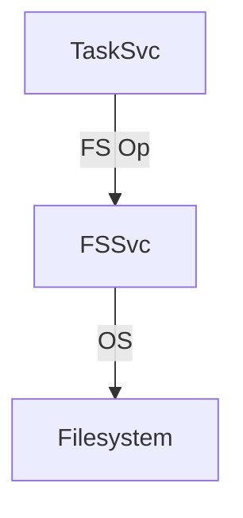
#### Level 2
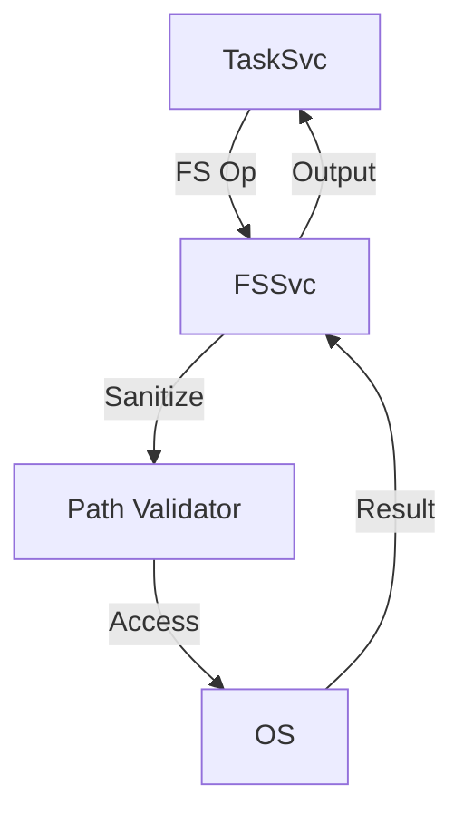

### 6.3 Table Definitions
| Field       | Type      | PK | FK | Description                |
|-------------|-----------|----|----|----------------------------|
| id          | TEXT      | Y  |    | FsJob unique identifier    |
| task_id     | TEXT      |    | Y  | FK to Task                 |
| op_type     | TEXT      |    |    | Operation type (read, write, delete) |
| path        | TEXT      |    |    | File path                  |
| content     | TEXT      |    |    | File content (write only)  |
| result      | TEXT      |    |    | Output/result              |
| status      | TEXT      |    |    | Job status                 |

### 6.4 API List
- `GET /fs/read` - Read file
- `POST /fs/write` - Write file
- `DELETE /fs/delete` - Delete file

---

## 7. Micro Frontend UI

### 7.1 Functional Requirements
- Submit tasks, monitor status, and view results
- Responsive, modular, accessible UI
- Integrate micro frontends via Module Federation

### 7.2 DFDs
#### Level 0
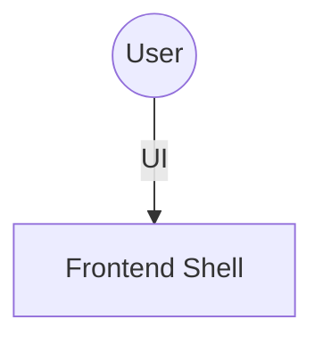
#### Level 1
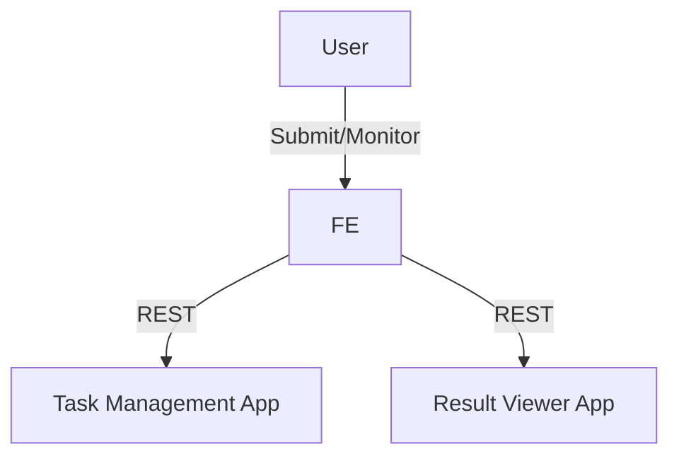
#### Level 2
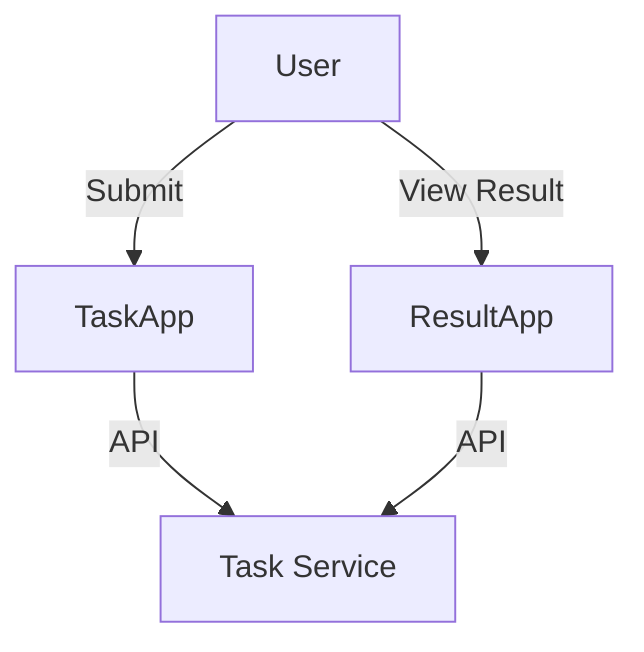

### 7.3 API List
- UI fetches all backend APIs listed above

---

## 8. Non-Functional Requirements
- **Security:** Sandbox code execution, restrict file ops, validate all input, audit logs
- **Performance:** Efficient HTTP handling, optimized queries, responsive UI
- **Testability:** Table-driven unit/integration tests, E2E coverage, CI pipelines
- **Documentation:** OpenAPI specs, user/developer docs, architecture diagrams
