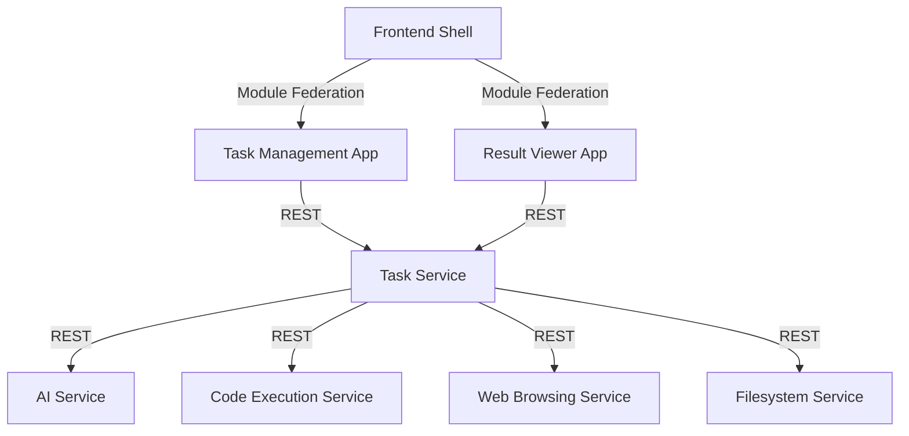
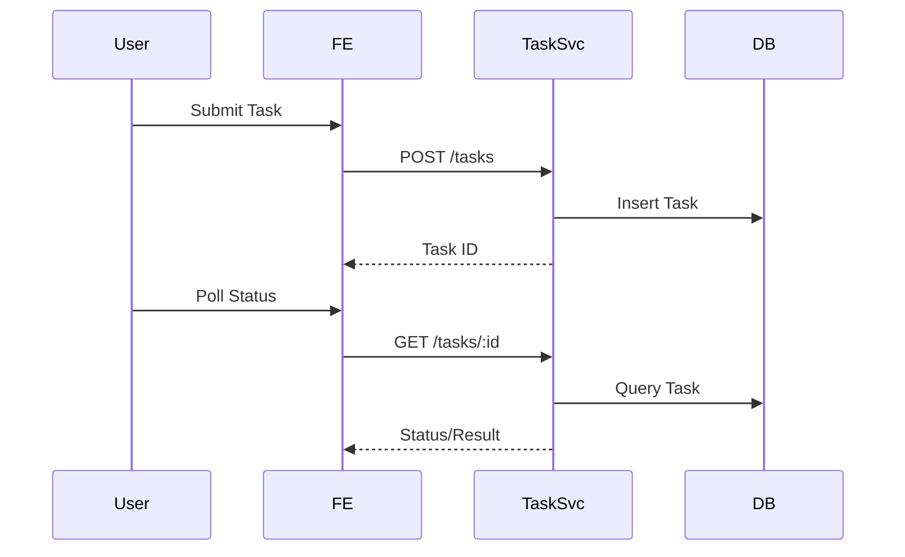
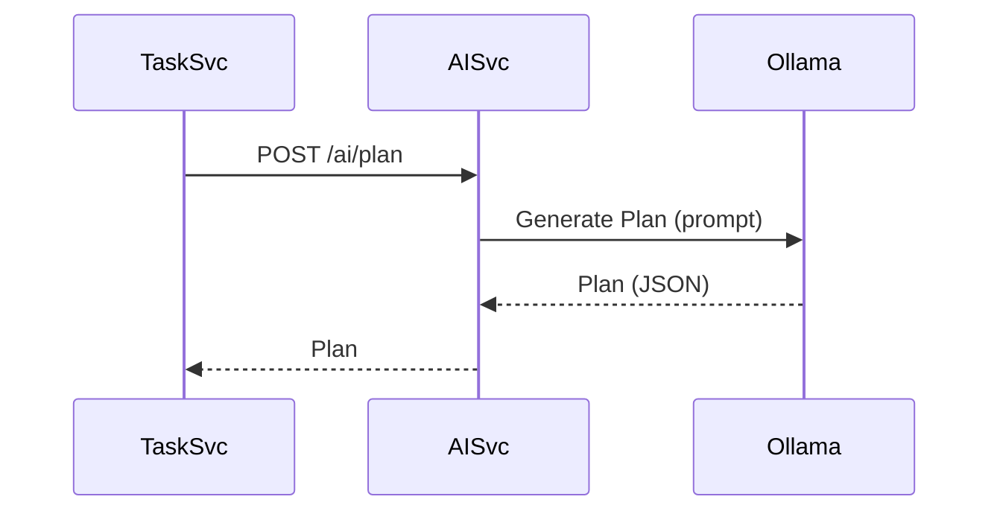
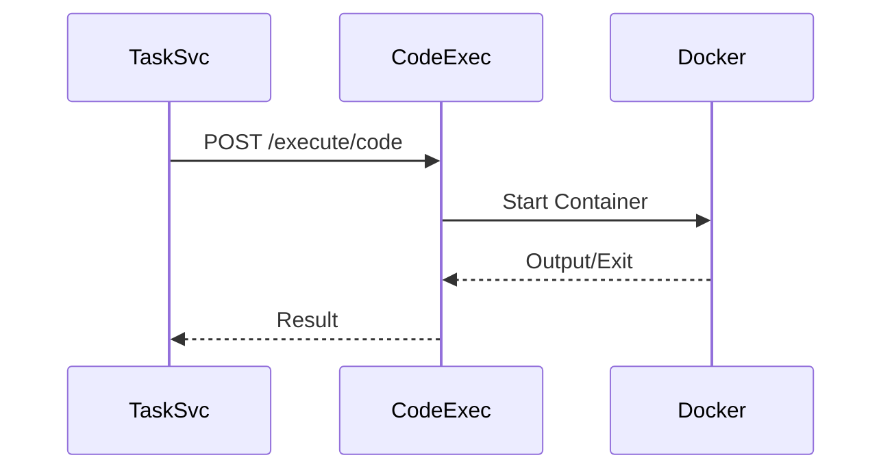
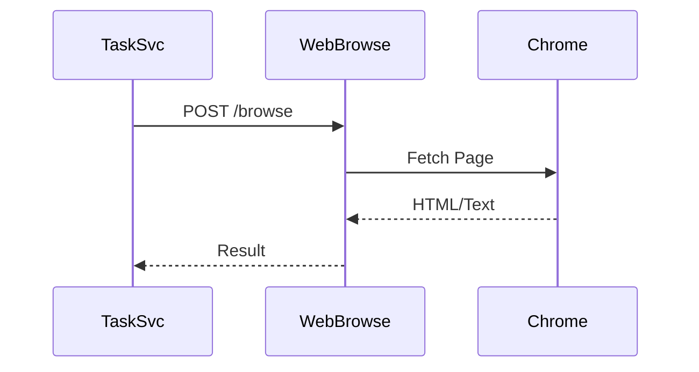
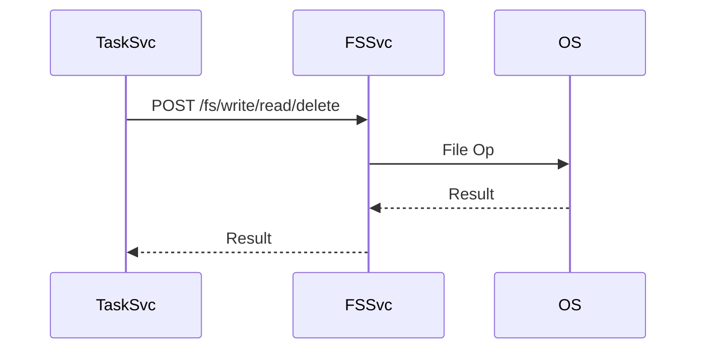
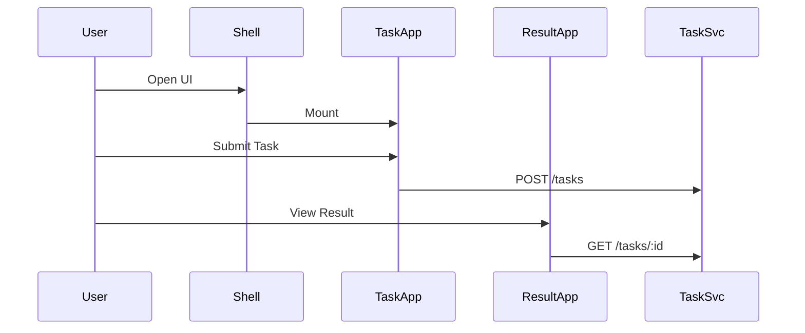
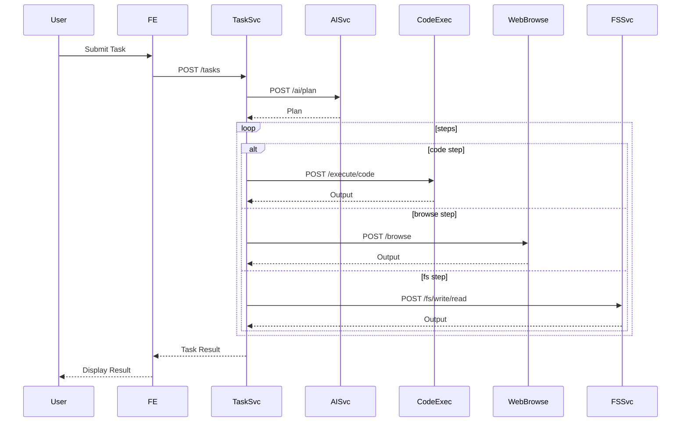
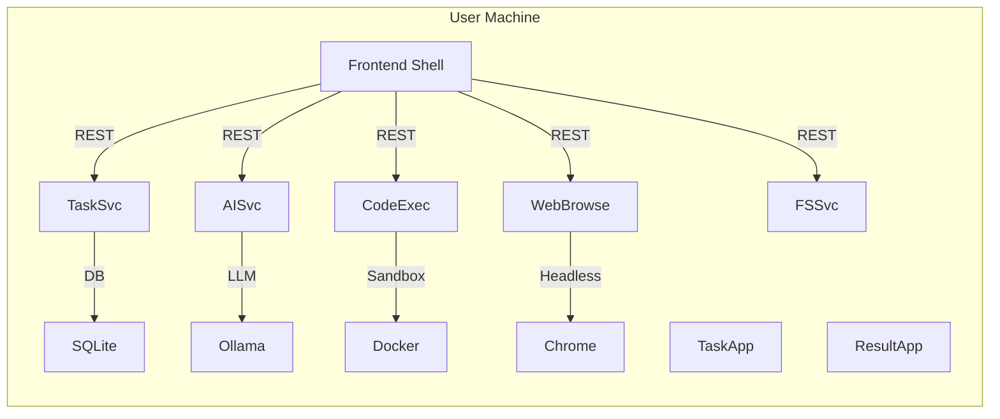

# Software Design Document (SDD)

## 1. Overview
- Clean Architecture, DDD, Microservices, Micro Frontends
- Go for backend, React/Vite/TS/Tailwind for frontend

## 2. Component Architecture

---

## 3. Feature Design Breakdown

### 3.1 Task Management
- **Purpose:** Manage task lifecycle as aggregate root.
- **Components:**
  - `domain/Task.go`: Entity, status enum
  - `usecase/CreateTask.go`, `GetTask.go`, `ListTasks.go`: Business logic
  - `infrastructure/TaskRepository.go`: SQLite repo
  - `delivery/http/TaskHandler.go`: Gin handlers
- **Sequence Diagram:**

- **Quality/Security:** Input validation, parameterized queries, audit logs.
- **Extensibility:** Add new task types by extending domain/usecase.

### 3.2 Local AI Reasoning
- **Purpose:** Generate stepwise plans for tasks using local LLM.
- **Components:**
  - `domain/Plan.go`, `Step.go`: Entities
  - `usecase/GeneratePlan.go`: Business logic
  - `infrastructure/OllamaClient.go`: REST integration
  - `delivery/http/AIHandler.go`: Gin handler
- **Sequence Diagram:**

- **Quality/Security:** Prompt sanitization, local-only requests, logging.
- **Extensibility:** Support new plan types by updating prompt templates and parser.

### 3.3 Secure Code Execution
- **Purpose:** Run user code securely in Docker sandbox.
- **Components:**
  - `domain/CodeJob.go`: Entity
  - `usecase/RunCode.go`: Business logic
  - `infrastructure/DockerRunner.go`: Docker API
  - `delivery/http/CodeHandler.go`: Gin handler
- **Sequence Diagram:**

- **Quality/Security:** Container resource limits, no host mounts, network off.
- **Extensibility:** Add new language runners by extending DockerRunner.

### 3.4 Autonomous Web Browsing
- **Purpose:** Automate web navigation and scraping.
- **Components:**
  - `domain/BrowseJob.go`: Entity
  - `usecase/FetchPage.go`: Business logic
  - `infrastructure/ChromedpClient.go`: chromedp integration
  - `delivery/http/WebHandler.go`: Gin handler
- **Sequence Diagram:**

- **Quality/Security:** Domain allowlist, output sanitization.
- **Extensibility:** Add new scraping strategies in usecase.

### 3.5 Secure Filesystem Operations
- **Purpose:** Perform safe file operations in workspace dir only.
- **Components:**
  - `domain/FsJob.go`: Entity
  - `usecase/ReadFile.go`, `WriteFile.go`, `DeleteFile.go`: Logic
  - `infrastructure/PathSanitizer.go`: Path validation
  - `delivery/http/FsHandler.go`: Gin handler
- **Sequence Diagram:**

- **Quality/Security:** Path whitelisting, audit logs.
- **Extensibility:** Support new file ops by adding usecases.

### 3.6 Micro Frontend UI
- **Purpose:** Modular, responsive UI for all user interactions.
- **Components:**
  - `shell/`: Hosts and loads remotes
  - `task-management-app/`: Task submission, list
  - `result-viewer-app/`: Result display
- **Sequence Diagram:**

- **Quality/Security:** Responsive, accessible, input validation.
- **Extensibility:** Add new micro frontends via Module Federation.

---

## 4. Backend Microservice Structure
- Each service: `domain/`, `usecase/`, `infrastructure/`, `delivery/http/`, `main.go`
- Communication: HTTP/JSON
- Storage: SQLite (Task), Docker (Code), chromedp (Web), OS (FS)

## 5. Frontend Micro Frontend Structure
- Shell: Loads remotes via Vite Module Federation
- Task Management App: Task submission, list, status
- Result Viewer App: Task result display
- Styling: TailwindCSS, responsive design

## 5. Sequence Diagram: Task Lifecycle

## 6. Deployment Diagram

## 7. Quality Attributes
- Security: Docker sandbox, FS restriction, input validation
- Testability: Table-driven, E2E, coverage
- Maintainability: Modular, documented, DDD
- Performance: Efficient APIs, optimized queries
